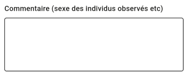
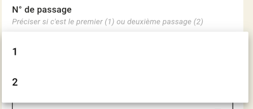
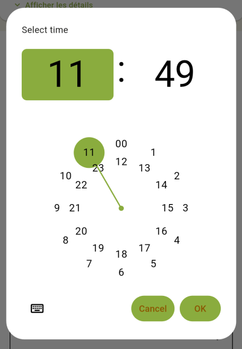
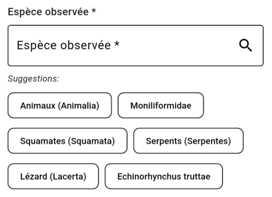
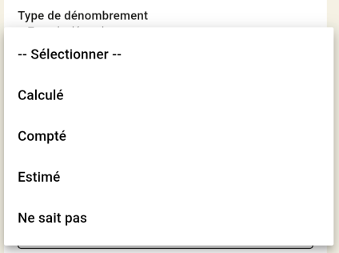
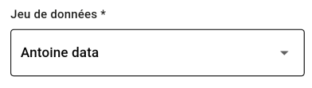

# Fonctionnalités Supportées - GeoNature Mobile Monitoring

Ce document détaille les capacités et limitations de l'application mobile GeoNature pour le monitoring de la biodiversité, avec un focus sur la compatibilité des modules de surveillance existants.

## 🚀 Capacités Générales des Formulaires

### Types de Champs Supportés

> 💡 **Note** : Chaque exemple inclut la configuration JSON qui génère le champ et une capture d'écran du rendu mobile.

#### 📝 Champs de Base

##### TextField - Saisie de texte simple
**Configuration JSON** (Module: ecrevisses_pattes_blanches)
```json
{
  "participants_nom": {
    "type_widget": "text",
    "attribut_label": "Participant(s) nom",
    "required": false
  }
}
```
**Paramètres clés** : `type_widget: "text"`, validation optionnelle

---

##### TextField_multiline - Saisie de texte multiligne
**Configuration JSON** (Module: RHOMEOOrthoptere)
```json
{
  "comments": {
    "type_widget": "textarea",
    "attribut_label": "Commentaire",
    "required": false
  }
}
```
**Paramètres clés** : `type_widget: "textarea"`, 3 lignes par défaut

 

---

##### NumberField - Saisie numérique avec validation
**Configuration JSON** (Module: RHOMEOOrthoptere)
```json
{
  "temperature": {
    "type_widget": "number",
    "attribut_label": "Température de l'air (°C)",
    "required": true,
    "min": 0,
    "max": 60
  }
}
```
**Paramètres clés** : `type_widget: "number"`, validation min/max

 

#### 🎯 Champs de Sélection

##### DropdownButton - Liste déroulante simple
**Configuration JSON** (Module: ecrevisses_pattes_blanches)
```json
{
  "periode": {
    "type_widget": "select",
    "values": [
      "Nocturne",
      "Diurne"
    ],
    "attribut_label": "Période",
    "required": true
  }
}
```
**Paramètres clés** : `type_widget: "select"`, valeurs simples

 

---

##### DatalistField - Sélection avec recherche
**Configuration JSON** (Module: RHOMEOOrthoptere) 
```json
{
    "methode_prospection": {
      "type_widget": "datalist",
      "multiple": true,
      "attribut_label": "Méthode de prospection",
      "values": ["Par observation directe", "Par plaques"],
      "required": "({value}) => value.accessibility === 'Oui'",
      "hidden": "({value}) => value.accessibility === 'Non'"
    },
}

```
**Paramètres clés** : `type_widget: "datalist"`, objets label/value, recherche intégrée

 

---

##### RadioButton - Boutons radio pour choix unique
**Configuration JSON** (Module: ecrevisses_pattes_blanches)
```json
{
  "chevelu_racinaire": {
    "type_widget": "radio",
    "values": [
      "oui",
      "non"
    ],
    "required": true,
    "value": "non",
    "attribut_label": "Chevelu racinaire"
  }
}
```
**Paramètres clés** : `type_widget: "radio"`, valeur par défaut possible

 

---

##### Checkbox - Cases à cocher
**Configuration JSON** (Module: pt_ecoute_avifaune)
```json
{
  "en_vol": {
    "type_widget": "bool_checkbox",
    "attribut_label": "Observé en vol",
    "description": "Observé en vol", 
    "default": false
  }
}
```
**Paramètres clés** : `type_widget: "bool_checkbox"`, valeur booléenne

 

#### 📅 Champs Date/Heure

##### DatePicker - Sélecteur de date
**Configuration JSON** (Module: RHOMEOOrthoptere)
```json
{
  "visit_date_min": {
    "type_widget": "date",
    "attribut_label": "Date du passage",
    "required": true
  }
}
```
**Paramètres clés** : `type_widget: "date"`, format ISO 8601

 

---

##### TimePicker - Sélecteur d'heure
**Configuration JSON** (Module: oedic)
```json
{
  "time_start": {
    "type_widget": "time",
    "attribut_label": "Heure de début"
  }
}
```
**Paramètres clés** : `type_widget: "time"`, format HH:MM

 

#### 🧬 Champs Spécialisés GeoNature

##### TaxonSelector - Sélection d'espèces avec recherche
**Configuration JSON** (Module: RHOMEOOrthoptere)
```json
{
  "cd_nom": {
    "type_widget": "taxonomy",
    "attribut_label": "Espèce observée",
    "multiple": false,
    "id_list": "__MODULE.ID_LIST_TAXONOMY",
    "application": "TaxHub",
    "required": true,
    "type_util": "taxonomy"
  }
}
```
**Paramètres clés** : `type_widget: "taxonomy"`, recherche par nom scientifique/français

 

---

##### NomenclatureSelector - Nomenclatures GeoNature
**Configuration JSON** (Module: ecrevisses_pattes_blanches)
```json
{
  "id_nomenclature_statut_observation": {
    "type_widget": "nomenclature",
    "attribut_label": "Statut d'observation",
    "code_nomenclature_type": "STATUT_OBS",
    "required": true,
    "type_util": "nomenclature"
  }
}
```
ou
```json
{
  "id_nomenclature_typ_denbr": {
    "type_widget": "datalist",
    "attribut_label": "Type de dénombrement",
    "api": "nomenclatures/nomenclature/TYP_DENBR",
    "application": "GeoNature",
    "keyValue": "id_nomenclature",
    "keyLabel": "label_fr",
    "data_path": "values",
    "type_util": "nomenclature",
    "required": "({value}) => value.presence === 'Oui'",
    "hidden":"({value}) => value.presence === 'Non'",
    "filters": {
        "cd_nomenclature": ["Co", "Es"]
    }
  },
}
```
**Paramètres clés** : `type_widget: "nomenclature"`, code référentiel

 

---

##### DatasetSelector - Sélection de jeux de données
**Configuration JSON** (Détection automatique)
```json
{
  "id_dataset": {
    "hidden": "({meta}) => meta.dataset && Object.keys(meta.dataset).length == 1"
  }
}
```
**Paramètres clés** : Détection automatique sur `id_dataset`, masqué si unique

 

---

##### ObserverField - Gestion des observateurs
Attention, ce champs est automatiquement assigné à l'utilisateur courant dans cette version de l'application mobile

**Configuration JSON** (Standard sur tous les formulaires)
```json
{
  "observers": {
    "type_widget": "observers",
    "attribut_label": "Observateurs",
    "required": true
  }
}
```
**Paramètres clés** : Gestion multi-observateurs, chips de suppression

 

#### 🔄 Mapping Configuration → Widget

| Configuration JSON | Widget Flutter | Particularités |
|-------------------|----------------|----------------|
| `"type_widget": "text"` | TextField | Validation optionnelle |
| `"type_widget": "textarea"` | TextField_multiline | 3 lignes par défaut |
| `"type_widget": "number"` | NumberField | Support min/max |
| `"type_widget": "date"` | DatePicker | Format ISO 8601 |
| `"type_widget": "time"` | TimePicker | Format HH:MM |
| `"type_widget": "select"` | DropdownButton | Valeurs simples |
| `"type_widget": "datalist"` | DatalistField | Recherche + label/value |
| `"type_widget": "radio"` | RadioButton | Choix unique |
| `"type_widget": "bool_checkbox"` | Checkbox | Valeur booléenne |
| `"type_widget": "nomenclature"` | NomenclatureSelector | Référentiels GN |
| `"type_widget": "taxonomy"` | TaxonSelector | Recherche taxonomique |
| `"type_widget": "observers"` | ObserverField | Multi-sélection |
| `"attribut_name": "id_dataset"` | DatasetSelector | Auto-détection |

### Conversion JavaScript → Dart

#### 📋 Résumé des Capacités de Conversion

L'application mobile supporte un **sous-ensemble limité** des expressions JavaScript utilisées dans GeoNature. Voici ce qui fonctionne et ce qui ne fonctionne pas :

**✅ CE QUI FONCTIONNE :**
- **Expressions simples** : Accès direct aux propriétés (`value.champ`)
- **Opérateurs de base** : Logiques (`&&`, `||`, `!`) et comparaisons (`==`, `!=`, `>`, `<`, etc.)
- **Conditions simples** : Tests booléens et comparaisons directes
- **Une fonction JS** : `Object.keys().length` uniquement

**❌ CE QUI NE FONCTIONNE PAS :**
- **Blocs de code** : Déclarations de variables, fonctions multi-lignes
- **Méthodes d'arrays** : `includes()`, `filter()`, `map()`, `reduce()`
- **Opérateurs avancés** : Ternaires complexes, null coalescing (`??`), optional chaining (`?.`)
- **Accès complexes** : Propriétés imbriquées (`value.obj.prop`), avec fallback (`|| {}`)
- **Paramètre meta** : Accès au contexte du formulaire (`meta.dataset`, `meta.parents`)
- **Manipulation de formulaires** : `objForm.patchValue()`, `objForm.controls`
- **Construction d'objets** : Création dynamique d'objets dans les expressions
- **Expressions régulières** : Tout pattern matching avec regex
- **Fonctions personnalisées** : Appels de fonctions non natives

**💡 IMPACT PRATIQUE :**
- **72% des modules** utilisent uniquement des expressions simples (compatibles)
- **28% des modules** nécessitent des adaptations ou sont incompatibles
- Les modules complexes comme `petite_chouette_montagne`, `RHOMEOFlore` nécessitent un refactoring

---

#### ✅ Expressions Supportées
```javascript
// Expressions simples
({value}) => value.test_detectabilite
({meta}) => meta.dataset && Object.keys(meta.dataset).length == 1
({value}) => !value.test_detectabilite && value.autre_champ

// Opérateurs logiques
&&, ||, !

// Comparaisons
==, !=, ===, !==, >, <, >=, <=

// Fonctions JS basiques
Object.keys().length
```

#### ❌ Expressions Non Supportées - Exemples Réels des Protocoles

##### 1. **Blocs Multi-lignes avec Déclarations** (petite_chouette_montagne)
```javascript
// observation.json - champ "change"
"change": [
    "({objForm, meta}) => {",
        "const nb_total = (objForm.value.nb_before_rep + objForm.value.nb_repasse);",
        "objForm.patchValue({nb_total});",
        "(objForm.value.cd_nom != (null || undefined) && objForm.value.cd_nom != 3507 ? objForm.patchValue({nb_passereau}) : '');",
    "}"
]
```
**Problème**: Déclarations de variables, appels de méthodes, logique complexe

##### 2. **Méthode includes() sur Arrays** (RHOMEOAmphibien)
```javascript
// observation.json - champ "duree_peche"
"hidden": "({value}) => ['Visuel',null].includes(value.typ_detection)"
"required": "({value}) => ['Pêche au troubleau','Auditif'].includes(value.typ_detection)"
```
**Problème**: Méthode `includes()` non convertie en Dart

##### 3. **Opérateurs Ternaires Complexes** (petite_chouette_montagne)
```javascript
// observation.json - champs "chev_chant", "sexe", "nb_passereau"
"hidden": "({value}) => (value.cd_nom != (null || undefined) ? value.cd_nom != 3507 : true)"
```
**Problème**: Comparaison avec `(null || undefined)` dans ternaire

##### 4. **Accès à Propriétés Imbriquées avec Fallback** (suivi_loutre_UICN_gmb)
```javascript
// observation.json - champs "nombre_individus", "sexe", "stade_de_vie"
"hidden": "({value, meta}) => (meta.nomenclatures[value.technique_observation] || {}).cd_nomenclature !== '0'"
```
**Problème**: Pattern `|| {}` et chaînage de propriétés

##### 5. **Propriétés Profondément Imbriquées** (suivi_loutre_UICN_gmb)
```javascript
// observation.json - champ "fraich_ep"
"hidden": "({value}) => !(value.cd_nom && value.cd_nom.cd_nom == 60630)"
```
**Problème**: Accès à `value.cd_nom.cd_nom` (double niveau)

##### 6. **Construction d'Objets dans Expressions** (cheveches)
```javascript
// visit.json - champ "id_base_site"
"params": [
    "({meta}) => ({",
        "id_module: __MODULE.ID_MODULE,",
        "id_sites_group: meta.parents.site && meta.parents.site.properties.id_sites_group,",
        "order_by: 'base_site_name*'",
    "})"
]
```
**Problème**: Création d'objet avec expressions conditionnelles

##### 7. **Manipulation de Formulaires** (suivi_phytosocio)
```javascript
// visit.json - champ "change"
"change":[
    "({objForm, meta}) => {",
      "const surf_releve = (objForm.value.type_placette == 'C' ? objForm.value.surf_releve_c : objForm.value.surf_releve_q)",
      "objForm.patchValue({surf_releve})",
    "}"
]
```
**Problème**: Manipulation directe du formulaire Angular

##### 8. **Paramètre meta avec Conditions** (cheveches)
```javascript
// visit.json - champ "id_base_site"
"hidden": "({meta, value}) => !meta.bChainInput && value.id_base_site"
```
**Problème**: Utilisation du contexte `meta` non supporté

##### Autres Patterns Non Supportés
```javascript
// Fonctions complexes
({value}) => value.items.filter(x => x.active).length > 0
({value}) => value.data.map(item => item.id)

// Expressions régulières
({value}) => /regex_pattern/.test(value.field)

// Fonctions personnalisées
({value}) => customFunction(value.field)
```

### Logique de Visibilité Conditionnelle

- ✅ **Conditions simples** : Masquage basé sur une valeur de champ
- ✅ **Conditions complexes** : Combinaisons avec opérateurs logiques
- ✅ **Cascades** : Champs cachés en cascade (A→B→C)
- ✅ **Auto-références** : Un champ peut se référencer lui-même
- ✅ **Persistance** : Conservation des valeurs des champs cachés

## 🔧 Architecture Technique

### Stack Technologique
- **Framework** : Flutter 3.22.3
- **Architecture** : Clean Architecture (Domain/Data/Presentation)
- **State Management** : Riverpod
- **Base de données locale** : Drift (SQLite)
- **Navigation** : GoRouter
- **Modèles** : Freezed (immutable)

### Pipeline de Traitement
```
Configuration JSON (GeoNature)
    ↓
FormConfigParser.generateUnifiedSchema()
    ↓ 
HiddenExpressionEvaluator.evaluateExpression()
    ↓
Widgets Flutter dynamiques
```

## 📊 État de Compatibilité des Modules

### Tableau de Compatibilité des Modules

| Module | Testé | Fonctionne | Complexité JS | Configuration | Notes |
|--------|-------|------------|---------------|---------------|-------|
| **apollons** | ✅ | ✅ | 🟢 Simple | Configuration complète | Module ID 21, expressions `hidden: true/false` |
| **cheveches** | ☐ | ☐ | 🟢 Simple | À tester | Expressions basiques uniquement |
| **chiro** | 🔄 | ⚠️ | 🟢 Simple | Tests d'erreurs | Expressions basiques, gestion d'erreurs testée |
| **chronocapture** | ☐ | ☐ | 🟢 Simple | À tester | Expressions basiques uniquement |
| **chronoventaire** | ☐ | ☐ | 🟢 Simple | À tester | Expressions basiques uniquement |
| **ecrevisses_pattes_blanches** | ☐ | ☐ | 🟡 Moyenne | À tester | Arrow functions avec comparaisons (`cd_nom != 18437`) |
| **lichens_bio_indicateurs** | ☐ | ☐ | 🟢 Simple | À tester | Expressions basiques uniquement |
| **ligne_lecture** | 🔄 | ☐ | 🟠 Complexe | Config d'exemple | `Object.keys(meta.dataset).length` nécessite extension |
| **micromam_analyse_pelotes_rejection_gmb** | ☐ | ☐ | 🟢 Simple | À tester | Expressions basiques uniquement |
| **nidif_gypa** | ☐ | ☐ | 🟢 Simple | À tester | Expressions basiques uniquement |
| **oedic** | ☐ | ☐ | 🟢 Simple | À tester | Expressions basiques uniquement |
| **osmodermes** | ☐ | ☐ | 🟢 Simple | À tester | Expressions basiques uniquement |
| **petite_chouette_montagne** | ☐ | ☐ | 🔴 Très complexe | À tester | Opérateurs ternaires imbriqués, manipulation formulaires |
| **piegeages_passifs** | ☐ | ☐ | 🟢 Simple | À tester | Expressions basiques uniquement |
| **POPAmphibien** | ☐ | ☐ | 🟡 Moyenne | À tester | Arrow functions moyennes (`count_min != 1`) |
| **POPReptile** | ✅ | ✅ | 🟡 Moyenne | Tests approfondis | Tests complets, expressions moyennes compatibles |
| **prairies_fleuries** | ☐ | ☐ | 🟢 Simple | À tester | Expressions basiques uniquement |
| **pt_ecoute_avifaune** | ☐ | ☐ | 🟢 Simple | À tester | Expressions basiques uniquement |
| **pyrales** | ☐ | ☐ | 🟢 Simple | À tester | Expressions basiques uniquement |
| **RHOMEOAmphibien** | ☐ | ☐ | 🟠 Complexe | À tester | Méthode `includes()` avec arrays |
| **RHOMEOFlore** | ☐ | ☐ | 🔴 Très complexe | À tester | Blocs multi-lignes, manipulation objForm |
| **RHOMEOOdonate** | ☐ | ☐ | 🟢 Simple | À tester | Expressions basiques uniquement |
| **RHOMEOOrthoptere** | ☐ | ☐ | 🟢 Simple | À tester | Expressions basiques uniquement |
| **sterf** | ☐ | ☐ | 🟢 Simple | À tester | Expressions basiques uniquement |
| **stom** | ☐ | ☐ | 🟢 Simple | À tester | Expressions basiques uniquement |
| **suivi_Camphi_gmb** | ☐ | ☐ | 🟢 Simple | À tester | Expressions basiques uniquement |
| **suivi_colo_chiro_gmb** | ☐ | ☐ | 🟢 Simple | À tester | Expressions basiques uniquement |
| **suivi_loutre_SACs_gmb** | ☐ | ☐ | 🟢 Simple | À tester | Expressions basiques uniquement |
| **suivi_loutre_UICN_gmb** | ☐ | ☐ | 🟢 Simple | À tester | Expressions basiques uniquement |
| **suivi_nardaie** | ☐ | ☐ | 🟢 Simple | À tester | Expressions basiques uniquement |
| **suivi_phytosocio** | ☐ | ☐ | 🔴 Très complexe | À tester | Blocs multi-lignes identiques à RHOMEOFlore |
| **suivi_terriers_blaireau_gmb** | ☐ | ☐ | 🟢 Simple | À tester | Expressions basiques uniquement |

### Légende

#### Statut de Test
- ✅ **Testé et fonctionne** : Module validé pour la production
- 🔄 **Partiellement testé** : Tests incomplets ou configuration d'exemple disponible
- ⚠️ **Fonctionne partiellement** : Limitations connues
- ☐ **Non testé** : Aucun test réalisé
- ❌ **Ne fonctionne pas** : Incompatible avec l'app mobile

#### Complexité JavaScript
- 🟢 **Simple** : Expressions `hidden: true/false` uniquement (100% compatible)
- 🟡 **Moyenne** : Arrow functions avec comparaisons simples (90% compatible)
- 🟠 **Complexe** : Méthodes JS natives, accès objets (60% compatible)
- 🔴 **Très complexe** : Blocs multi-lignes, manipulation formulaires (20% compatible)

### Résumé Statistique

#### Par Statut de Test
- **Total des modules** : 32
- **Modules testés et fonctionnels** : 2 (6,25%)
- **Modules partiellement testés** : 2 (6,25%)
- **Modules non testés** : 28 (87,5%)

#### Par Complexité JavaScript
- **🟢 Simple** : 23 modules (72%) - Prêts pour test
- **🟡 Moyenne** : 3 modules (9%) - Convertibles facilement
- **🟠 Complexe** : 3 modules (9%) - Nécessitent extension du convertisseur
- **🔴 Très complexe** : 3 modules (9%) - Nécessitent refactoring

## ⚠️ Limitations Connues

### Types de Widgets Manquants
- ❌ **Champs de fichiers/médias** : Upload d'images, documents
- ❌ **Champs géographiques** : Coordonnées GPS, cartes interactives
- ❌ **Champs avancés** : Couleurs, sliders, ranges
- ❌ **Composants complexes** : Tables dynamiques, formulaires imbriqués

### Validation Avancée
- ❌ **Validations cross-champs** : Pas de validation entre plusieurs champs
- ❌ **Validations asynchrones** : Pas de vérification côté serveur en temps réel
- ❌ **Messages d'erreur personnalisés** : Limités aux messages par défaut

### Performance
- ⚠️ **Rebuild complet** : Reconstruction de tout le formulaire lors de changements
- ⚠️ **Pas de lazy loading** : Tous les champs générés d'emblée
- ⚠️ **Cache limité** : Pas de mise en cache des configurations complexes

## 🔧 Analyse Détaillée des Expressions JavaScript Problématiques

### Modules avec Expressions Complexes Nécessitant Attention

#### 🟠 **ligne_lecture** - Accès aux métadonnées
```javascript
"hidden": "({meta}) => meta.dataset && Object.keys(meta.dataset).length == 1"
```
**Solution** : Extension du convertisseur pour supporter `Object.keys()` → `map.keys` en Dart

#### 🟠 **RHOMEOAmphibien** - Méthode includes()
```javascript
"hidden": "({value}) => ['Visuel',null].includes(value.typ_detection)"
"required": "({value}) => ['Pêche au troubleau','Auditif'].includes(value.typ_detection)"
```
**Solution** : Extension du convertisseur pour supporter `includes()` → `contains()` en Dart

#### 🔴 **petite_chouette_montagne** - Opérateurs ternaires complexes
```javascript
"hidden": "({value}) => (value.cd_nom != (null || undefined) ? value.cd_nom != 3507 : true)"
```
**Solution** : Refactoring nécessaire en conditions if/else simples

#### 🔴 **RHOMEOFlore & suivi_phytosocio** - Blocs multi-lignes
```javascript
"change": [
    "({objForm, meta}) => {",
        "const base_site_name = 'T' + (objForm.value.num_transect) + 'Q' + (objForm.value.num_placette);",
        "if (!objForm.controls.base_site_name.dirty) {",
            "objForm.patchValue({base_site_name})",
        "}",
    "}"
]
```
**Solution** : Refactoring complet en fonctions Dart avec gestion d'état Flutter

## 📋 Recommandations par Complexité

### 🟢 Modules Simples (23 modules) - Prêts pour Test
Ces modules utilisent uniquement `"hidden": true/false` et sont **100% compatibles** :
- **apollons**, **cheveches**, **chiro**, **chronocapture**, **chronoventaire**
- **lichens_bio_indicateurs**, **micromam_analyse_pelotes_rejection_gmb**
- **nidif_gypa**, **oedic**, **osmodermes**, **piegeages_passifs**
- **prairies_fleuries**, **pt_ecoute_avifaune**, **pyrales**
- **RHOMEOOdonate**, **RHOMEOOrthoptere**, **sterf**, **stom**
- Tous les modules **suivi_*** (sauf suivi_phytosocio)

**Recommandation** : Tests prioritaires, compatibilité garantie

### 🟡 Modules Moyens (3 modules) - Extensions Mineures Requises
- **ecrevisses_pattes_blanches**, **POPAmphibien**, **POPReptile**

**Recommandation** : Convertisseur actuel suffisant avec extensions mineures

### 🟠 Modules Complexes (3 modules) - Extensions Majeures Requises
- **ligne_lecture**, **RHOMEOAmphibien**

**Recommandation** : Développement d'extensions pour `Object.keys()` et `includes()`

### 🔴 Modules Très Complexes (3 modules) - Refactoring Nécessaire
- **petite_chouette_montagne**, **RHOMEOFlore**, **suivi_phytosocio**

**Recommandation** : Report de compatibilité, refactoring JavaScript requis

## 📝 Plan de Développement Recommandé

### Phase 1 - Tests Immédiats (23 modules 🟢)
1. Tester tous les modules simples
2. Valider la compatibilité 100%
3. Documenter les modules fonctionnels

### Phase 2 - Extensions Convertisseur (3 modules 🟠)
1. Supporter `Object.keys()` → `map.keys`
2. Supporter `includes()` → `contains()`
3. Tester modules complexes

### Phase 3 - Refactoring (3 modules 🔴)
1. Simplifier opérateurs ternaires
2. Convertir blocs multi-lignes en fonctions Dart
3. Adapter manipulation formulaires à Flutter

### Comment Contribuer
Pour mettre à jour ce tableau après avoir testé un module :
1. Modifiez le fichier `SUPPORTED_FEATURES.md`
2. Changez ☐ vers ✅ (testé et fonctionne) ou ❌ (ne fonctionne pas)
3. Mettez à jour la complexité JS si nécessaire
4. Documentez les expressions JavaScript problématiques découvertes

## 🔄 Processus de Test d'un Nouveau Module

1. **Analyse des fichiers de configuration**
   - `module.json`, `site.json`, `visit.json`, `observation.json`
   - Vérification des expressions JavaScript

2. **Test des composants**
   - Types de champs utilisés
   - Logique de visibilité conditionnelle
   - Nomenclatures et taxonomie

3. **Test d'intégration**
   - Mode hors-ligne
   - Synchronisation serveur
   - Gestion d'erreurs

4. **Validation fonctionnelle**
   - Workflow complet de saisie
   - Export des données
   - Cohérence avec GeoNature web

## 📞 Support et Contribution

Pour tester un nouveau module ou signaler des problèmes :
1. Créer une issue sur le repository GitHub
2. Fournir les fichiers de configuration du module
3. Décrire les fonctionnalités critiques à valider
4. Documenter les expressions JavaScript complexes utilisées

---

**Dernière mise à jour** : 30 juillet 2025  
**Version de l'application** : Flutter 3.22.3  
**Architecture** : Clean Architecture avec Riverpod